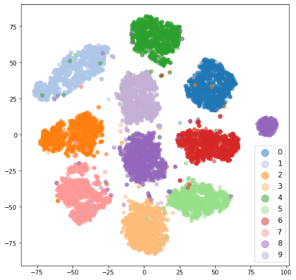
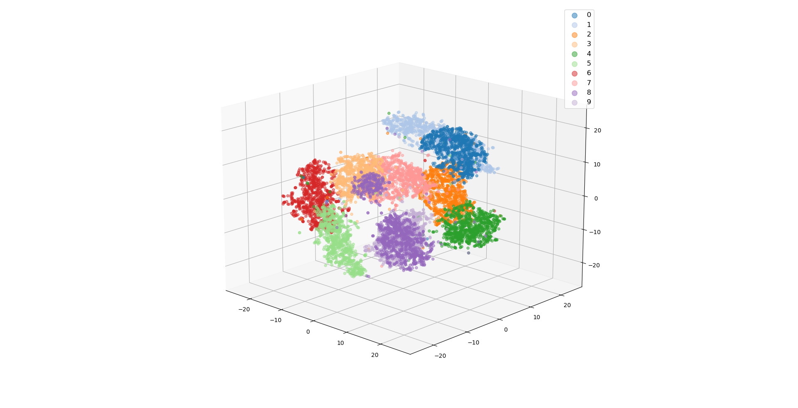
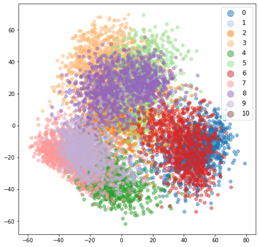
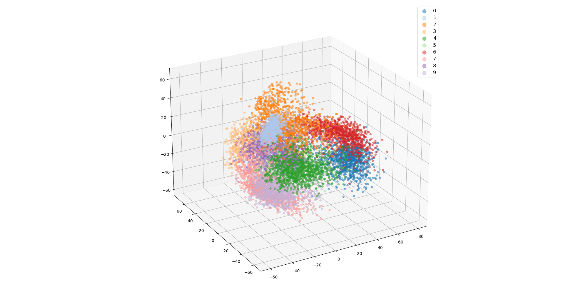
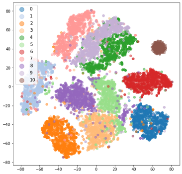
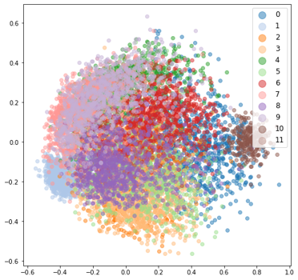

# Embeddings / Feature Vector visualization using t-SNE and PCA
This repository contains the code for visualizing embeddings / feature vectors using t-SNE and PCA.The example plots are shown for model trained on the MNIST dataset with 1000 noise images randomly injected into the test set. The training code is also available. I used PyTorch and Lightning in this for the DL component. However, the logic should be similar for any framework.

The sample plots of embeddings extracted from a trained model are shown below.
t-SNE plot 2D

t-SNE plot 3D

PCA plot 2D

PCA plot 3D

I've shown the projections of embeddings extracted from randomly initialized model as well.

t-SNE plot 2D

PCA plot 2D

